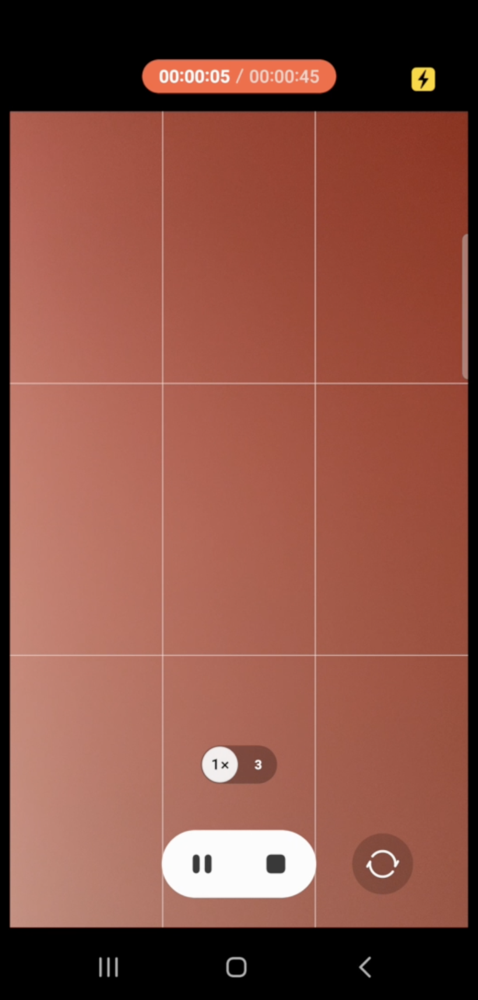

# Context Monitoring Application

## Overview

This Android application is designed to capture a 45-second video (where the user puts their finger against rear camera with the flash on) to calculate heart rate. It also collects accelerometer readings for 45 seconds (with the user laying down and keeping the phone on their chest) to calculate respiratory rate. Additionally, it allows users to rate 10 different symptoms on a 5-star rating scale. The user can then upload both heart rate and respiratory rate data as well as symptom ratings to a SQLite database.

## Features

- **Heart Rate Measurement**: Capture a 45-second video to calculate heart rate.

- **Respiratory Rate Measurement**: Collect accelerometer readings for 45 seconds to calculate respiratory rate.

- **Symptom Rating**: Rate 10 different symptoms on a 5-star rating scale.

- **Data Upload**: Two separate buttons, one on each activity, allow users to upload heart rate + respiratory rate and symptom rating data to the SQLite database.

## Screenshots

### The two activities

### Heart Rate Measurement

### Respiratory Rate Measurement

### Calculated values
PS: Don't mind the high respiratory rate, I was moving the phone around!

### Database live updates

## Technologies Used

- Android Studio
- Java
- SQLite

## Made By
[Adrija Nag](https://github.com/adrijanag17)
